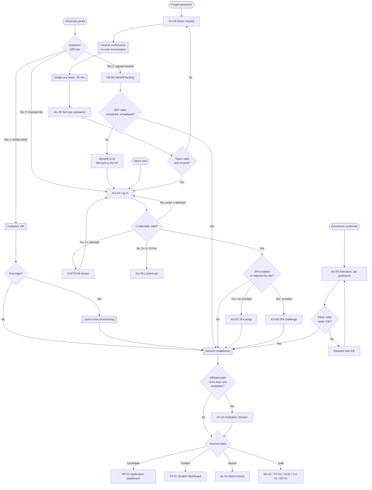

# App Flow
## Multi-Institutional LMS — Post Graduate Diploma in Data Protection & Privacy

| | |
|---|---|
| **Document** | 03 — App Flow |
| **Version** | 1.0 |
| **Date** | 11 September 2026 |
| **Source of truth** | PGD-DPP-Platform-PRD v0.3 |
| **Scope rule** | Every screen below traces to a PRD requirement ID. Nothing has been invented. Where the PRD is silent or self-contradictory, it is flagged in §5 rather than resolved by assumption |

**Reading notes**
- Screen IDs (`AP-03`) are **screen identifiers** and are deliberately distinct from PRD requirement IDs (`APP-03`). Do not confuse the two.
- Phase tags follow the PRD roadmap: **P1** Admissions & Payments, **P2** Learning, **P3** Knowledge & Community.
- Routes assume the tenant-subdomain model in PRD §4 and §7.4. `{school}` is the institution subdomain; `app.` is platform-scope, `www.` is public.

---

## 1. Journey Summary (plain English)

### The primary journey

A prospective candidate lands on the public site and browses the programme. Because this is a multi-institutional platform, the very first meaningful decision is **which university** — that choice locks in the branding, the fees, the entry requirements and the cohort calendar for everything that follows, so it happens before the application form opens.

They create an account with an email address and verify it. Inside their application dashboard they complete a multi-step form — personal details, education history, work experience, next of kin — which saves as a draft continuously, so they can abandon it on a bad connection and come back. They upload their credentials and crop a passport photograph. They give granular consent, purpose by purpose, not as one blanket agreement. They review everything and submit.

Submission is gated by a **non-refundable application fee**. They pay through Paystack's hosted checkout and land back on a pending screen — the application is not marked paid by the browser returning, but by Paystack's webhook arriving, so there is a genuine intermediate state the candidate can see and does not have to guess about.

The application now sits with the university's registry. Registry can query a single document without rejecting the whole application, which sends the candidate back to re-upload just that one item. Eventually a decision lands: admitted, rejected, or waitlisted.

An admitted candidate gets an admission letter as a branded PDF with a verification code, and an offer that **expires** — a countdown is visible, and a lapsed offer releases the cohort seat back to the registry. Accepting the offer opens the second, separate checkout: acceptance fee and tuition. On settlement the system creates the enrollment, issues a matriculation number, and transitions the account from Candidate to Student.

As a student they work through modules and lessons, sit assessments, submit assignments, see grades, and read announcements. They search the Resource Centre for research papers and the E-Library for legislation, judgments and guidance — with the library's link-out items clearly distinguished from the ones they can actually download. On completion they receive a certificate with a public verification URL, and their account transitions again, to Alumni: they keep library access permanently and gain the national alumni directory, the jobs board, and their own school's private channel.

### The secondary journeys

- **Returning by any of three doors.** A student may arrive at their university's portal and be handed over via federated SSO, via a signed short-lived link, or simply by clicking a branded tile and logging in natively. All three land in the same place; only the authentication screens differ.
- **Losing a password.** Request a reset, receive a single-use link, set a new one. The request screen deliberately tells you nothing about whether the account exists.
- **Exercising privacy rights.** A student can export their own data, correct their own profile, and toggle each consent independently, without filing a request with anyone. Only what cannot be self-served becomes a ticket in the DPO console, where a 30-day statutory clock runs visibly.
- **Running the institution.** Registry officers work an application queue. Facilitators author content and grade. Institution admins configure fees, cohorts, staff, branding and their Paystack subaccount, and reconcile settlement. Curators ingest library items and record a licence for every single one. The DPO works requests, grievances, breaches and purge reports.

### The shape of the thing

Three distinct account lifecycles — **Candidate → Student → Alumni** — each unlocking different navigation, running on top of a tenant-scoped platform where a staff member can only ever see their own institution's people. Two payment events with an academic decision between them. And a set of shared, cross-institution surfaces (library, national alumni space) that deliberately sit outside tenant isolation.

---

## 2. Screen Inventory

### 2.1 Public (unauthenticated)

| ID | Screen | Route | Phase | PRD trace |
|---|---|---|---|---|
| PB-01 | Platform landing | `www./` | P1 | §1.1, APP-06 |
| PB-02 | Institution & programme browse | `www./programmes` | P1 | APP-06, §4 |
| PB-03 | Institution programme detail | `{school}./programme` | P1 | APP-06, §4 |
| PB-04 | Cohort & intake selection | `{school}./programme/apply` | P1 | APP-06 |
| PB-05 | Trust & compliance page | `www./trust` | P1 | CMP-18, CMP-02 |
| PB-06 | Privacy notice (versioned) | `www./privacy/v{n}` | P1 | CMP-05 |
| PB-07 | Certificate verification | `www./verify/{code}` | P2 | LRN-08, §6.4 |
| PB-08 | University portal handoff landing | `{school}./sso/handoff` | P1 | SSO-02 |
| PB-09 | SSO integration guide (for university IT) | `www./integrations` | P1 | SSO-05 |

### 2.2 Authentication

| ID | Screen | Route | Phase | PRD trace |
|---|---|---|---|---|
| AU-01 | Sign up | `{school}./signup` | P1 | APP-01 |
| AU-02 | Email verification pending | `{school}./signup/verify` | P1 | APP-01 |
| AU-03 | Log in | `{school}./login` | P1 | AUTH-05, AUTH-06 |
| AU-04 | Forgot password request | `{school}./forgot` | P1 | AUTH-04 |
| AU-05 | Reset password (token) | `{school}./reset/{token}` | P1 | AUTH-04 |
| AU-06 | Account activation / set password | `{school}./activate/{token}` | P1 | AUTH-01, AUTH-02 |
| AU-07 | 2FA enrolment (TOTP) | `app./security/2fa/setup` | P1 | AUTH-08 |
| AU-08 | 2FA challenge | `{school}./login/2fa` | P1 | AUTH-08 |
| AU-09 | Rate-limit lockout | `{school}./login/locked` | P1 | AUTH-06 |
| AU-10 | Institution chooser (multi-affiliation) | `app./choose-institution` | P2 | SSO-04 |

### 2.3 Candidate — application & payment

| ID | Screen | Route | Phase | PRD trace |
|---|---|---|---|---|
| AP-01 | Application dashboard / status tracker | `{school}./apply` | P1 | APP-07 |
| AP-02 | Form — personal details | `{school}./apply/personal` | P1 | APP-02, APP-03 |
| AP-03 | Form — education history | `{school}./apply/education` | P1 | APP-02 |
| AP-04 | Form — work experience & sponsor | `{school}./apply/experience` | P1 | APP-02 |
| AP-05 | Form — document upload | `{school}./apply/documents` | P1 | APP-04 |
| AP-06 | Passport photo crop | `{school}./apply/documents/photo` | P1 | APP-05 |
| AP-07 | Consent capture | `{school}./apply/consent` | P1 | APP-02, CMP-06 |
| AP-08 | Review & submit | `{school}./apply/review` | P1 | APP-02 |
| AP-09 | Document query response | `{school}./apply/queries/{id}` | P1 | APP-08 |
| AP-10 | Admission outcome | `{school}./apply/outcome` | P1 | APP-07, APP-10 |
| AP-11 | Admission letter viewer | `{school}./apply/letter` | P1 | APP-10 |
| PY-01 | Application fee checkout | `{school}./pay/application` | P1 | PAY-01, PAY-02 |
| PY-02 | Payment pending (awaiting webhook) | `{school}./pay/pending/{ref}` | P1 | PAY-03 |
| PY-03 | Payment success | `{school}./pay/success/{ref}` | P1 | PAY-07 |
| PY-04 | Payment failed / abandoned | `{school}./pay/failed/{ref}` | P1 | PAY-10 |
| PY-05 | Acceptance & tuition checkout | `{school}./pay/tuition` | P1 | §5.1 LOCKED, PAY-01 |
| PY-06 | Offline payment proof upload | `{school}./pay/offline` | P1 | PAY-11 |
| PY-07 | Enrollment confirmed | `{school}./enrolled` | P1 | §5.1 LOCKED |

### 2.4 Student

| ID | Screen | Route | Phase | PRD trace |
|---|---|---|---|---|
| ST-01 | Student dashboard | `{school}./dashboard` | P2 | LRN-03, LRN-06 |
| ST-02 | Programme structure / module list | `{school}./programme` | P2 | LRN-01 |
| ST-03 | Lesson player | `{school}./lesson/{id}` | P2 | LRN-02, LRN-03, LRN-09 |
| ST-04 | Assessment — instructions | `{school}./assessment/{id}` | P2 | LRN-04 |
| ST-05 | Assessment — in progress | `{school}./assessment/{id}/attempt` | P2 | LRN-04 |
| ST-06 | Assessment — result | `{school}./assessment/{id}/result` | P2 | LRN-04, LRN-05 |
| ST-07 | Assignment submission | `{school}./assignment/{id}` | P2 | LRN-04 |
| ST-08 | Gradebook | `{school}./grades` | P2 | LRN-05 |
| ST-09 | Announcements | `{school}./announcements` | P2 | LRN-06 |
| ST-10 | Cohort forum | `{school}./forum` | P2 | LRN-06 |
| ST-11 | Live sessions | `{school}./live` | P2 | LRN-07 |
| ST-12 | Certificates | `{school}./certificates` | P2 | LRN-08 |
| ST-13 | Payments & receipts | `{school}./billing` | P1 | PAY-07 |
| ST-14 | Profile & account | `app./profile` | P1 | CMP-07 |
| ST-15 | Privacy & consent settings | `app./privacy` | P1 | CMP-06, §6.5 |
| ST-16 | Data export / my data | `app./privacy/export` | P1 | CMP-07 |
| ST-17 | Active sessions | `app./security/sessions` | P1 | AUTH-07 |

### 2.5 Knowledge — Resource Centre & E-Library

| ID | Screen | Route | Phase | PRD trace |
|---|---|---|---|---|
| RC-01 | Resource Centre search | `app./resources` | P3 | RES-01, RES-02 |
| RC-02 | Resource item detail | `app./resources/{id}` | P3 | RES-03, RES-05 |
| RC-03 | Submit a paper | `app./resources/submit` | P3 | RES-04 |
| RC-04 | Saved searches & reading list | `app./resources/saved` | P3 | RES-06 |
| LB-01 | E-Library search | `app./library` | P3 | LIB-01, LIB-02 |
| LB-02 | Library item detail | `app./library/{id}` | P3 | LIB-06 |
| LB-03 | Document reader | `app./library/{id}/read` | P3 | LIB-03 |
| LB-04 | Link-out interstitial | `app./library/{id}/external` | P3 | LIB-02, LIB-06 |
| LB-05 | Takedown request | `www./library/takedown` | P3 | LIB-07 |

### 2.6 Alumni

| ID | Screen | Route | Phase | PRD trace |
|---|---|---|---|---|
| AL-01 | Alumni home | `app./alumni` | P3 | ALM-01, ALM-10 |
| AL-02 | Alumni directory | `app./alumni/directory` | P3 | ALM-03, ALM-12 |
| AL-03 | Alumni profile (own, editable) | `app./alumni/profile` | P3 | ALM-02 |
| AL-04 | National forum | `app./alumni/forum` | P3 | ALM-04 |
| AL-05 | School channel | `app./alumni/school/{id}` | P3 | ALM-10, ALM-12 |
| AL-06 | Jobs board | `app./alumni/jobs` | P3 | ALM-05 |
| AL-07 | Events & RSVP | `app./alumni/events` | P3 | ALM-06 |
| AL-08 | Report content | modal | P3 | ALM-08 |

### 2.7 Staff — registry, faculty, institution admin

| ID | Screen | Route | Phase | PRD trace |
|---|---|---|---|---|
| RG-01 | Application queue | `{school}./admin/applications` | P1 | APP-07, §5.9 |
| RG-02 | Application review detail | `{school}./admin/applications/{id}` | P1 | APP-04, APP-08 |
| RG-03 | Raise document query | modal on RG-02 | P1 | APP-08 |
| RG-04 | Decision & offer issuance | modal on RG-02 | P1 | APP-10, §5.1 LOCKED |
| RG-05 | Cohort capacity view | `{school}./admin/cohorts/{id}` | P1 | §5.1 LOCKED |
| RG-06 | Applicant data export | `{school}./admin/applications/export` | P1 | APP-09 |
| FC-01 | Facilitator course list | `{school}./teach` | P2 | LRN-05 ⚠ see §5 |
| FC-02 | Content authoring | `{school}./teach/{module}` | P2 | LRN-01, LRN-02 |
| FC-03 | Grading queue | `{school}./teach/grading` | P2 | LRN-05 |
| IA-01 | Institution admin home | `{school}./admin` | P1 | §5.9 |
| IA-02 | Programme & module setup | `{school}./admin/programme` | P1 | §5.9, LRN-01 |
| IA-03 | Fee schedule | `{school}./admin/fees` | P1 | PAY-01 |
| IA-04 | Cohort calendar | `{school}./admin/cohorts` | P1 | §5.9 |
| IA-05 | Staff & roles | `{school}./admin/staff` | P1 | §5.9, CMP-14 |
| IA-06 | Branding | `{school}./admin/branding` | P1 | §4 |
| IA-07 | Paystack subaccount setup | `{school}./admin/payouts` | P1 | PAY-06 |
| IA-08 | Reconciliation dashboard | `{school}./admin/reconciliation` | P1 | PAY-08 |
| IA-09 | Offline payment approvals | `{school}./admin/payments/offline` | P1 | PAY-11 |
| IA-10 | Alumni channel broadcast | `{school}./admin/alumni` | P3 | ALM-11 |

### 2.8 Platform — curator, super admin, DPO

| ID | Screen | Route | Phase | PRD trace |
|---|---|---|---|---|
| CU-01 | Curator console / ingest queue | `app./curate` | P3 | LIB-05, LIB-09 |
| CU-02 | Item metadata & licence editor | `app./curate/{id}` | P3 | LIB-05, LIB-06 |
| CU-03 | Submission approval queue | `app./curate/submissions` | P3 | RES-04 |
| SA-01 | Tenant provisioning | `app./platform/tenants` | P1 | §4, §5.9 |
| SA-02 | Platform analytics | `app./platform/analytics` | P1 | §9 |
| SA-03 | Feature flags | `app./platform/flags` | P1 | §5.9 |
| DP-01 | DPO console home | `app./dpo` | P1 | §5.9 |
| DP-02 | Data subject request queue | `app./dpo/requests` | P1 | CMP-07 |
| DP-03 | Request detail & fulfilment | `app./dpo/requests/{id}` | P1 | CMP-07 |
| DP-04 | SNAG intake & response | `app./dpo/snag` | P1 | CMP-08 |
| DP-05 | Breach register | `app./dpo/breaches` | P1 | CMP-09 |
| DP-06 | Consent records | `app./dpo/consents` | P1 | CMP-06 |
| DP-07 | Retention & purge report | `app./dpo/retention` | P1 | CMP-10 |
| DP-08 | Compliance evidence export | `app./dpo/evidence` | P1 | CMP-16 |

### 2.9 System states

| ID | Screen | Trigger | Phase | PRD trace |
|---|---|---|---|---|
| SY-01 | 404 not found | Bad route | P1 | — |
| SY-02 | 403 forbidden / wrong tenant | RLS denial | P1 | CMP-14 |
| SY-03 | 500 error | Server fault | P1 | — |
| SY-04 | Session expired | Idle/revoked | P1 | AUTH-07 |
| SY-05 | Offline / connection lost | Network | P1 | §8 bandwidth |
| SY-06 | Maintenance | Scheduled | P1 | §8 availability |

**Total: 96 screens.** P1: 54 · P2: 22 · P3: 20.

---

## 3. Flowcharts

### 3.1 Primary journey — discovery to alumni

```mermaid
flowchart TD
    Start(["Candidate arrives"]) --> PB01["PB-01 Platform landing"]
    PB01 --> PB02["PB-02 Institution browse"]
    PB02 --> PB03["PB-03 Programme detail"]
    PB03 --> PB04["PB-04 Cohort selection"]
    PB04 --> AuthCheck{"Logged in?"}
    AuthCheck -->|No| AU01["AU-01 Sign up"]
    AuthCheck -->|Yes| AP01["AP-01 Application dashboard"]
    AU01 --> AU02["AU-02 Verify email"]
    AU02 --> Verified{"Token valid?"}
    Verified -->|No / expired| AU02
    Verified -->|Yes| AP01

    AP01 --> AP02["AP-02 Personal details"]
    AP02 --> AP03["AP-03 Education history"]
    AP03 --> AP04["AP-04 Work and sponsor"]
    AP04 --> AP05["AP-05 Documents"]
    AP05 --> AP06["AP-06 Photo crop"]
    AP06 --> AP07["AP-07 Consent"]
    AP07 --> AP08["AP-08 Review and submit"]
    AP08 --> Complete{"All required<br/>fields and docs?"}
    Complete -->|No| AP08
    Complete -->|Yes| PY01["PY-01 Application fee checkout"]

    PY01 --> Paystack1[["Paystack hosted checkout"]]
    Paystack1 --> PY02["PY-02 Payment pending"]
    PY02 --> Webhook1{"charge.success<br/>webhook received?"}
    Webhook1 -->|Yes| PY03["PY-03 Payment success"]
    Webhook1 -->|No after timeout| PY04["PY-04 Payment failed"]
    PY04 --> Retry{"Retry?"}
    Retry -->|Yes| PY01
    Retry -->|Offline transfer| PY06["PY-06 Offline proof upload"]
    PY06 --> IA09["IA-09 Admin approves"]
    IA09 --> PY03
    PY03 --> Submitted["Status: Submitted"]

    Submitted --> RG01["RG-01 Registry queue"]
    RG01 --> RG02["RG-02 Review detail"]
    RG02 --> Decision{"Registry decision"}
    Decision -->|Query a document| RG03["RG-03 Raise query"]
    RG03 --> AP09["AP-09 Candidate re-uploads"]
    AP09 --> RG02
    Decision -->|Reject| AP10R["AP-10 Outcome: Rejected"]
    Decision -->|Waitlist| AP10W["AP-10 Outcome: Waitlisted"]
    Decision -->|Admit| Capacity{"Cohort seat<br/>available?"}
    Capacity -->|No| AP10W
    Capacity -->|Yes| RG04["RG-04 Issue offer"]
    RG04 --> AP10A["AP-10 Outcome: Admitted"]
    AP10A --> AP11["AP-11 Admission letter"]
    AP10W --> WaitOut{"Seat frees<br/>before intake?"}
    WaitOut -->|Yes| RG04
    WaitOut -->|No| Closed(["Application closed"])
    AP10R --> Purge[["Retention clock starts<br/>CMP-10"]]

    AP11 --> Offer{"Accept offer<br/>before expiry?"}
    Offer -->|Expired| Lapsed["Offer lapsed<br/>seat released"]
    Lapsed --> RG05["RG-05 Capacity view"]
    Offer -->|Decline| Closed
    Offer -->|Accept| PY05["PY-05 Acceptance and tuition"]
    PY05 --> Paystack2[["Paystack hosted checkout"]]
    Paystack2 --> PY02b["PY-02 Payment pending"]
    PY02b --> Webhook2{"Webhook received?"}
    Webhook2 -->|No| PY04
    Webhook2 -->|Yes| PY07["PY-07 Enrollment confirmed"]
    PY07 --> Matric[["Matric number issued<br/>Candidate becomes Student"]]

    Matric --> ST01["ST-01 Student dashboard"]
    ST01 --> ST02["ST-02 Module list"]
    ST02 --> ST03["ST-03 Lesson player"]
    ST03 --> ST04["ST-04 Assessment"]
    ST04 --> ST06["ST-06 Result"]
    ST06 --> ST08["ST-08 Gradebook"]
    ST08 --> Done{"Programme<br/>complete?"}
    Done -->|No| ST02
    Done -->|Yes| ST12["ST-12 Certificate"]
    ST12 --> AL01["AL-01 Alumni home"]
    AL01 --> Alumni(["Student becomes Alumni<br/>library access retained"])
```

### 3.2 Authentication & entry paths

### 3.3 Staff & compliance flows

```mermaid
flowchart TD
    StaffLogin(["Staff login, 2FA mandatory"]) --> Role{"Role"}

    Role -->|Registry| RG01["RG-01 Application queue"]
    RG01 --> RG02["RG-02 Review detail"]
    RG02 --> RG03["RG-03 Query document"]
    RG02 --> RG04["RG-04 Decision and offer"]
    RG04 --> RG05["RG-05 Cohort capacity"]
    RG01 --> RG06["RG-06 Export applicants"]

    Role -->|Facilitator| FC01["FC-01 Course list"]
    FC01 --> FC02["FC-02 Author content"]
    FC01 --> FC03["FC-03 Grading queue"]
    FC03 --> Graded[["Grade released to ST-08"]]

    Role -->|Institution admin| IA01["IA-01 Admin home"]
    IA01 --> IA02["IA-02 Programme setup"]
    IA01 --> IA03["IA-03 Fee schedule"]
    IA01 --> IA04["IA-04 Cohorts"]
    IA01 --> IA05["IA-05 Staff and roles"]
    IA01 --> IA06["IA-06 Branding"]
    IA01 --> IA07["IA-07 Paystack subaccount"]
    IA07 --> Verify{"Bank account<br/>name resolves?"}
    Verify -->|No| IA07
    Verify -->|Yes| SplitReady[["Split configured, tenant can take payments"]]
    IA01 --> IA08["IA-08 Reconciliation"]
    IA08 --> Drift{"Drift flagged by<br/>nightly job?"}
    Drift -->|Yes| Investigate["Manual review"]
    IA01 --> IA09["IA-09 Offline approvals"]

    Role -->|Curator| CU01["CU-01 Ingest queue"]
    CU01 --> CU02["CU-02 Metadata and licence"]
    CU02 --> Licence{"Licence and<br/>provenance recorded?"}
    Licence -->|No| CU02
    Licence -->|Yes| Publish{"Hostable under<br/>licence?"}
    Publish -->|Yes| LB02["LB-02 Item, downloadable"]
    Publish -->|No| LB04["LB-04 Link-out only"]
    CU01 --> CU03["CU-03 Submission approvals"]

    Role -->|DPO| DP01["DP-01 DPO console"]
    DP01 --> DP02["DP-02 DSR queue"]
    DP02 --> DP03["DP-03 Fulfil request"]
    DP03 --> Clock{"Within 30 days?"}
    Clock -->|"Day 20 / Day 27"| Alert[["Escalating alerts"]]
    Clock -->|Fulfilled| Closed(["Logged and closed"])
    DP03 --> Controller{"Whose data?"}
    Controller -->|Institution-controlled| RouteReg["Route to registry, assist"]
    Controller -->|Platform-controlled| Handle["DPO handles directly"]
    DP01 --> DP04["DP-04 SNAG"]
    DP04 --> Substantive{"Violation accepted?"}
    Substantive -->|Yes| Remedy["State remedial action"]
    Substantive -->|No| Explain["Explain why no violation"]
    DP01 --> DP05["DP-05 Breach register"]
    DP05 --> Notify{"Notifiable?"}
    Notify -->|Yes| Clock72[["72h to NDPC, subjects without undue delay"]]
    Notify -->|No| LogOnly["Log with reasoning"]
    DP01 --> DP07["DP-07 Retention and purge"]
    DP01 --> DP08["DP-08 Evidence export"]

    Role -->|Super admin| SA01["SA-01 Tenant provisioning"]
    SA01 --> NewTenant[["Subdomain, branding, subaccount, staff seeded"]]
```

---

## 4. Screen-by-screen behaviour

### 4.1 Public

---

**PB-01 · Platform landing** — `www./` · P1

- **Purpose** Explain the programme, establish credibility, route to institution selection.
- **Reached by** Direct visit, search, referral.
- **Shows** Programme proposition, participating institutions, how enrollment works, next intake dates, link to trust page.
- **Primary action** *Browse programmes* → PB-02.
- **Secondary** *Log in* → AU-03 · *Verify a certificate* → PB-07 · *Trust & compliance* → PB-05.
- **States** Loading skeleton · No institutions live yet (empty: "Applications open soon", email capture only if marketing consent is captured separately per CMP-06) · Error.
- **Edge cases** Arriving on `www.` while holding a session on a `{school}.` subdomain — offer "Continue to your dashboard" rather than forcing re-login.

---

**PB-02 · Institution & programme browse** — `www./programmes` · P1

- **Purpose** Let the candidate choose which university, since this choice drives fees, requirements and branding thereafter (APP-06).
- **Reached by** PB-01, direct link.
- **Shows** Card per institution: name, logo, location, next intake, application deadline, application fee, tuition, entry requirements summary, open/closed status.
- **Primary action** *View programme* → PB-03 (navigates to that tenant's subdomain).
- **Secondary** Filter by intake date or location.
- **States** Loading · Empty (no open intakes — show closed institutions with next expected intake) · Partial (some tenants configured but not published — hidden entirely, not greyed).
- **Edge cases** An institution's intake closes while the candidate is browsing — PB-03 shows closed state rather than 404.

---

**PB-03 · Institution programme detail** — `{school}./programme` · P1

- **Purpose** Full programme information under that institution's branding; the conversion page.
- **Reached by** PB-02, university's own website, portal tile.
- **Shows** Institution branding (logo, colours per IA-06), programme structure, entry requirements, full fee breakdown, intake dates, delivery format, contact.
- **Primary action** *Apply now* → PB-04.
- **Secondary** *Log in* → AU-03 · Download programme brochure if the institution has uploaded one.
- **States** Loading · Applications closed (CTA replaced with next intake date) · Institution suspended (SY-02).
- **Edge cases** Direct arrival at an unprovisioned subdomain → SY-01, never a blank branded shell.

---

**PB-04 · Cohort & intake selection** — `{school}./programme/apply` · P1

- **Purpose** Bind the application to a specific cohort before any data is collected (APP-06).
- **Reached by** PB-03.
- **Shows** Available intakes with start date, application deadline, seats indication, fee for that cohort.
- **Primary action** *Continue* → AU-01 if unauthenticated, AP-01 if authenticated.
- **Secondary** *Back* → PB-03.
- **After action** Cohort selection persisted against the draft application; all subsequent fees derive from it.
- **States** Loading · Single cohort (auto-select, show confirmation rather than a pointless choice) · All cohorts full (see §5 gap G-06) · Deadline passed mid-session.
- **Edge cases** Candidate already holds a submitted application for this institution → redirect to AP-01 with a message, not a second application.

---

**PB-05 · Trust & compliance page** — `www./trust` · P1

- **Purpose** CMP-18. Also a sales asset for registrars.
- **Reached by** Footer on every page, PB-01.
- **Shows** Current privacy notice link, DPO name and contact, NDPC registration status, sub-processor list, security summary, takedown contact.
- **Primary action** *Contact the DPO*.
- **Secondary** *Read privacy notice* → PB-06 · *Request library takedown* → LB-05.
- **States** Static; must render without JavaScript.

---

**PB-06 · Privacy notice (versioned)** — `www./privacy/v{n}` · P1

- **Purpose** CMP-05 — notices are versioned documents, and a consent record links to the version in force at capture.
- **Reached by** Footer, AP-07, ST-15, DP-06.
- **Shows** Full notice text, version number, effective date, changelog, link to prior versions.
- **Primary action** None (read-only).
- **Secondary** *View version history*.
- **Edge cases** A student following a link from their own consent record must land on **that version**, not the current one.

---

**PB-07 · Certificate verification** — `www./verify/{code}` · P2

- **Purpose** Public verification of a certificate by third parties — employers, the NDPC, other institutions (LRN-08).
- **Reached by** Scanning or typing a code from a certificate; no authentication.
- **Shows** Strictly data-minimised per §6.4: holder name, programme, institution, cohort, status (valid / revoked). Nothing else — no email, no matric number, no photograph.
- **Primary action** *Verify another code*.
- **States** Valid · Not found · Revoked (show revoked explicitly, do not show "not found") · Rate-limited (prevents enumeration of codes).
- **Edge cases** Code enumeration is a real attack here — codes must be non-sequential and the endpoint rate-limited per IP.

---

**PB-08 · University portal handoff landing** — `{school}./sso/handoff` · P1

- **Purpose** Tier 2 signed-JWT entry (SSO-02).
- **Reached by** Redirect from the university portal carrying a signed token.
- **Shows** Brief "Signing you in…" state only; not a page users dwell on.
- **After action** Valid token (≤120s, unreplayed nonce) → session minted → routed by account state. Invalid → error with a *Log in instead* fallback to AU-03.
- **States** Verifying · Token expired · Token replayed · Signature invalid · Unknown student identifier.
- **Edge cases** Token valid but the student has no enrollment at this institution → explicit error, never auto-provision. Clock skew between portal and platform is the most common real-world failure — allow a small tolerance and log it.

---

**PB-09 · SSO integration guide** — `www./integrations` · P1

- **Purpose** SSO-05 — published documentation and sandbox credentials for university IT teams.
- **Reached by** Direct link given during institutional onboarding.
- **Shows** Tier 1/2/3 explanation, JWT payload spec, key exchange process, sandbox endpoint, test credentials, troubleshooting.
- **Primary action** *Request sandbox credentials*.

---

### 4.2 Authentication

---

**AU-01 · Sign up** — `{school}./signup` · P1

- **Purpose** Create a candidate account before the application form opens (APP-01).
- **Reached by** PB-04, AU-03 "create an account".
- **Shows** Email, password, password confirmation, live password strength against AUTH-02 policy (min 10 chars, letters and numbers, common-password blocklist), CAPTCHA (AUTH-05), link to privacy notice.
- **Primary action** *Create account* → account created unverified → AU-02.
- **Secondary** *Log in instead* → AU-03.
- **States** Idle · Validating · Submitting · Email already registered (neutral message + "we've sent a sign-in link", no enumeration) · Weak password · CAPTCHA failed · Rate-limited.
- **Edge cases** Signing up on School A's subdomain when an account already exists from School B — see gap G-03.

---

**AU-02 · Email verification pending** — `{school}./signup/verify` · P1

- **Purpose** Confirm the email address is reachable before any personal data is collected.
- **Reached by** AU-01.
- **Shows** "Check your email", the address used, resend control with cooldown, "wrong address?" correction path.
- **Primary action** Clicking the emailed link → verified → AP-01.
- **Secondary** *Resend* (rate-limited, 60s cooldown) · *Change email address*.
- **States** Waiting · Resent · Cooldown active · Token expired (offer resend) · Already verified (route straight to AP-01).
- **Edge cases** Deliverability is a funnel risk (§8) — surface a "not arrived? check spam, or contact us" path after 2 minutes.

---

**AU-03 · Log in** — `{school}./login` · P1

- **Purpose** Authenticate returning users of every role.
- **Reached by** Everywhere; Tier 3 portal tile; session expiry (SY-04).
- **Shows** Email, password, "remember me" (30-day max per AUTH-07), CAPTCHA after 3 failed attempts (AUTH-05), institution branding.
- **Primary action** *Log in* → 2FA branch → routed by account state (Candidate → AP-01, Student → ST-01, Alumni → AL-01, Staff → role home).
- **Secondary** *Forgot password* → AU-04 · *Create account* → AU-01 · Institution SSO button where Tier 1 is configured.
- **States** Idle · Submitting · Invalid credentials (generic message) · CAPTCHA required · Locked out → AU-09 · Unverified email → AU-02 · Account suspended.
- **Edge cases** Deep-link preservation — a user hitting a protected URL, logging in, must land at that URL and not the dashboard.

---

**AU-04 · Forgot password request** — `{school}./forgot` · P1

- **Purpose** AUTH-04.
- **Reached by** AU-03.
- **Shows** Email field, CAPTCHA.
- **Primary action** *Send reset link* → **always** the same neutral confirmation regardless of whether the account exists.
- **States** Idle · Submitting · Confirmation (identical in both cases) · Rate-limited by IP.
- **Edge cases** The neutral response is a hard requirement, not a nicety — resist product pressure to "helpfully" say the account wasn't found.

---

**AU-05 · Reset password** — `{school}./reset/{token}` · P1

- **Purpose** Set a new password from a single-use 30-minute token (AUTH-04).
- **Reached by** Emailed link.
- **Shows** New password, confirmation, policy indicator.
- **Primary action** *Set password* → all existing sessions invalidated → AU-03 with success message.
- **States** Valid token · Expired · Already used · Invalid → all route to AU-04 with a clear explanation and a re-request control.
- **Edge cases** Requesting a second reset must invalidate the first token.

---

**AU-06 · Account activation / set password** — `{school}./activate/{token}` · P1

- **Purpose** AUTH-01 — single-use 24-hour activation link replacing emailed plaintext passwords.
- **Reached by** Email sent on enrollment confirmation (PY-07). **See gap G-01 — this collides with AU-01 for candidates who already have an account.**
- **Shows** Welcome, institution branding, password fields, policy indicator.
- **Primary action** *Activate* → session → ST-01.
- **States** Valid · Expired (self-serve resend) · Already activated (route to AU-03).

---

**AU-07 · 2FA enrolment** — `app./security/2fa/setup` · P1

- **Purpose** AUTH-08 — mandatory for Registry, Institution Admin, Super Admin and DPO; optional for students.
- **Reached by** Forced interstitial at first staff login; voluntarily from ST-14.
- **Shows** QR code, manual secret, verification field, recovery codes (shown once).
- **Primary action** *Verify and enable* → recovery codes confirmation → destination.
- **Secondary** *Skip* — available to students only; **not rendered at all** for mandatory roles.
- **States** Generating · Verifying · Invalid code · Enabled · Recovery codes unacknowledged (blocks progress).
- **Edge cases** A staff member who loses their authenticator needs an admin-mediated reset path — see gap G-08.

---

**AU-08 · 2FA challenge** — `{school}./login/2fa` · P1

- **Purpose** Second factor at login.
- **Shows** 6-digit field, "use a recovery code" link, trust-this-device option.
- **Primary action** *Verify* → session → routed by role.
- **States** Idle · Invalid code · Expired window · Locked after repeated failure · Recovery code accepted (warn that one is now consumed).

---

**AU-09 · Rate-limit lockout** — `{school}./login/locked` · P1

- **Purpose** AUTH-06 — 5 failures per account per 15 minutes, progressive lockout.
- **Shows** Plain explanation, time remaining, password reset link, support contact.
- **Primary action** *Reset password* → AU-04.
- **Edge cases** Do not reveal whether the locked account exists. Shared-IP throttling must not lock out an entire university's computer lab — throttle per account primarily, per IP secondarily and more loosely.

---

**AU-10 · Institution chooser** — `app./choose-institution` · P2

- **Purpose** SSO-04 — one human, one account, possibly two institutions.
- **Reached by** Post-authentication when more than one affiliation exists.
- **Shows** Card per affiliation: institution, role, status (student/alumni), cohort.
- **Primary action** *Continue* → sets tenant context → role home.
- **Secondary** *Set as default*.
- **Edge cases** Context must be switchable later without logging out — persistent switcher in the account menu. **See gap G-07 on cross-tenant context leakage.**

---

### 4.3 Candidate — application

---

**AP-01 · Application dashboard / status tracker** — `{school}./apply` · P1

- **Purpose** APP-07 — the candidate's home for the whole admissions phase; the screen that prevents "has anything happened?" support tickets.
- **Reached by** Post-verification, post-login as Candidate, every email link.
- **Shows** Status stepper (Draft → Submitted → Under Review → Documents Queried → Admitted / Rejected / Waitlisted), selected institution and cohort, completion percentage, outstanding items, payment status, decision date if known, document queries if open.
- **Primary action** Context-dependent: *Continue application* → AP-02 · *Pay application fee* → PY-01 · *Respond to query* → AP-09 · *View outcome* → AP-10.
- **Secondary** *Download my data* → ST-16 · *Withdraw application* — **see gap G-04, no such flow is specified in the PRD**.
- **States** No application started (empty state, single CTA) · Draft in progress · Awaiting payment · Under review · Query open (visually dominant) · Decision issued · Offer expiring (countdown) · Offer lapsed · Rejected · Waitlisted.
- **Edge cases** Cohort deadline passes while in Draft — the form must lock with an explanation and a pointer to the next intake, not silently accept a submission that registry will discard.

---

**AP-02 · Personal details** — `{school}./apply/personal` · P1

- **Purpose** APP-02 first step.
- **Reached by** AP-01, step navigation.
- **Shows** Full name, DOB, gender, phone, address, state of origin, nationality, next of kin. **NIN appears only where the institution has enabled it** (§6.4 defaults to not collecting; if enabled it is masked on entry and never re-displayed).
- **Primary action** *Save and continue* → AP-03.
- **Secondary** *Save draft and exit* → AP-01 (though autosave per APP-03 makes this belt-and-braces) · *Back*.
- **After action** Autosave on field blur and every 30s; last-saved timestamp always visible.
- **States** Loading draft · Saving · Saved · Save failed (queue locally, retry, warn before navigation) · Validation errors inline · Field locked after submission.
- **Edge cases** Connection loss mid-form is the normal case, not the exception (§8) — local persistence and a visible sync indicator are required, not optional.

---

**AP-03 · Education history** — `{school}./apply/education` · P1

- **Purpose** APP-02 — prior institutions, degrees, class of degree, graduation years.
- **Shows** Repeatable entry rows; at least one required.
- **Primary action** *Save and continue* → AP-04.
- **Secondary** *Add another qualification* · *Remove* · *Back*.
- **States** Empty (one blank row) · Multiple entries · Validation (graduation year not in the future; degree required before class of degree).

---

**AP-04 · Work experience & sponsor** — `{school}./apply/experience` · P1

- **Purpose** APP-02 — work experience and sponsor details.
- **Primary action** *Save and continue* → AP-05.
- **States** Optional-section handling (work experience may legitimately be empty for a fresh graduate; sponsor details conditional on self-sponsored vs sponsored).
- **Edge cases** If sponsored, sponsor contact details are third-party personal data — the candidate must be told the sponsor will be contacted, and this must be reflected in the privacy notice.

---

**AP-05 · Document upload** — `{school}./apply/documents` · P1

- **Purpose** APP-04 — degree certificate, transcript, NYSC certificate, passport photograph, ID.
- **Shows** Checklist per required document, accepted formats (PDF/JPG/PNG), 5MB cap, per-item status, preview thumbnails.
- **Primary action** *Upload* → client-side compression → presigned direct-to-storage upload (§7.6) → virus scan → thumbnail → item marked complete. Then *Continue* → AP-06 if a photo was uploaded, else AP-07.
- **Secondary** *Replace* · *Delete* · *Take a photo* (mobile camera).
- **States** Empty checklist · Uploading with progress · Compressing · Scanning · Complete · Rejected: too large / wrong format / virus detected / unreadable · Upload failed with retry.
- **Edge cases** A phone photograph of a transcript is routinely 6MB+ — compression happens before the size check, or every mobile candidate hits a wall. Multi-page transcripts photographed as several images need either multi-file-per-slot support or explicit guidance; the PRD does not settle this (gap G-09).

---

**AP-06 · Passport photo crop** — `{school}./apply/documents/photo` · P1

- **Purpose** APP-05 — in-browser cropping with resolution and aspect-ratio validation.
- **Reached by** AP-05 after a photo upload.
- **Shows** Crop tool with fixed aspect ratio, zoom, rotate, live preview, guidance on acceptable photographs.
- **Primary action** *Save photo* → AP-07 (or back to AP-05 checklist).
- **Secondary** *Upload a different photo* · *Skip for now* (leaves the item incomplete and blocks submission).
- **States** Loading image · Cropping · Resolution too low (reject with a specific reason) · Saving · Saved.
- **Edge cases** Cropping must work on a small touchscreen. The photograph is used for ID card, exam identity and certificate (§6.4) — and explicitly **not** for facial recognition, which should be stated in the privacy notice, not just in the PRD.

---

**AP-07 · Consent capture** — `{school}./apply/consent` · P1

- **Purpose** APP-02 and §6.5 — granular, unbundled consent.
- **Shows** Four separate toggles, each independently refusable: (a) processing of application data, (b) retention post-programme, (c) inclusion in the alumni directory, (d) marketing communications. Each with plain-language purpose text and a link to the notice version in force.
- **Primary action** *Continue* → AP-08.
- **Secondary** *Read the full privacy notice* → PB-06.
- **After action** A consent record is written per purpose, storing timestamp, notice version, capture mechanism, IP and user agent.
- **States** All off (default) · Partial · Required-basis explanation shown.
- **Edge cases** Per §6.4, application processing rests on **contract**, not consent. So (c) and (d) are genuinely optional and refusing them must not block submission. If refusing (a) or (b) blocks progress, they are not consent and must not be presented as toggles — **see gap G-02, the PRD is internally inconsistent here.**

---

**AP-08 · Review & submit** — `{school}./apply/review` · P1

- **Purpose** Final check before a non-refundable payment.
- **Shows** Every section read-only with per-section *Edit*, document thumbnails, consent summary, the application fee amount and an explicit non-refundable statement.
- **Primary action** *Submit and pay* → PY-01.
- **Secondary** *Edit section* → relevant step · *Download a copy of my application*.
- **States** Incomplete (submit disabled, with a specific list of what is missing and jump links) · Complete · Submitting · Deadline passed mid-review.
- **Edge cases** The non-refundable nature of the fee must be disclosed **before** payment, not after (§5.1). Show it here, on PY-01, and on the receipt.

---

**AP-09 · Document query response** — `{school}./apply/queries/{id}` · P1

- **Purpose** APP-08 — re-upload one queried item without reopening the whole application.
- **Reached by** Email notification, AP-01 banner.
- **Shows** Which document, the registry officer's note, the original file, a single upload control.
- **Primary action** *Upload replacement* → status returns to Under Review → AP-01.
- **Secondary** *Message the registry* — **not supported by the PRD; see gap G-05**.
- **States** Query open · Uploading · Resolved · Query closed by registry without response · Multiple simultaneous queries (list them; do not resolve the application until all are closed).

---

**AP-10 · Admission outcome** — `{school}./apply/outcome` · P1

- **Purpose** Communicate the decision and, for admitted candidates, run the offer clock.
- **Reached by** Email notification, AP-01.
- **Shows** *Admitted*: congratulations, admission letter link, fees due, **offer expiry countdown** (institution-configurable, default 14 days), accept and decline controls. *Rejected*: decision, plain-language reason if the institution supplies one, what happens to their documents and when they are deleted (CMP-10). *Waitlisted*: position if the institution publishes it, expected resolution date.
- **Primary action** Admitted → *Accept offer* → PY-05. Rejected → *Download my data* → ST-16. Waitlisted → no action available.
- **Secondary** *View admission letter* → AP-11 · *Decline offer* → confirmation → application closed.
- **States** Admitted · Offer expiring (<48h, visually escalated) · Offer lapsed (seat released, explain and offer next-intake path) · Accepted, payment pending · Rejected · Waitlisted · Waitlist promoted.
- **Edge cases** A rejected candidate's screen is the one place the retention promise becomes visible to the person it protects — state the deletion date explicitly. Decline is irreversible and must be confirmed.

---

**AP-11 · Admission letter viewer** — `{school}./apply/letter` · P1

- **Purpose** APP-10 — branded PDF with a unique verification code.
- **Shows** Inline PDF preview, download, verification code.
- **Primary action** *Download PDF*.
- **States** Generating (letters render asynchronously per §7.2) · Ready · Generation failed (retry, and alert the institution).

---

### 4.4 Candidate — payments

---

**PY-01 · Application fee checkout** — `{school}./pay/application` · P1

- **Purpose** PAY-01, PAY-02 — first of the two locked payment events.
- **Reached by** AP-08, AP-01.
- **Shows** Line item(s) for the application fee, total in NGN, non-refundable statement, institution name, Paystack branding.
- **Primary action** *Pay now* → Paystack hosted checkout → return to PY-02.
- **Secondary** *Pay by bank transfer* → PY-06 · *Back to application*.
- **States** Idle · Initialising transaction · Redirecting · Paystack unreachable (explain, offer PY-06) · Already paid (route forward, never double-charge).
- **Edge cases** No card data ever touches our UI. If the candidate abandons at Paystack, the transaction is held 24h with one reminder (PAY-10).

---

**PY-02 · Payment pending** — `{school}./pay/pending/{ref}` · P1

- **Purpose** PAY-03 — the honest intermediate state. The browser callback returns here; confirmation comes from the webhook.
- **Reached by** Return from Paystack.
- **Shows** "Confirming your payment", reference, spinner, reassurance that money has left and no further action is needed, support contact with the reference.
- **Primary action** None — polls for webhook confirmation.
- **After action** Confirmed → PY-03 (or PY-07 for tuition). Not confirmed within timeout → PY-04 with explicit "do not pay again" guidance and a reference to quote.
- **States** Polling · Confirmed · Timeout · Webhook received but processing failed (route to support, never to "failed" — the money arrived).
- **Edge cases** This screen exists precisely because callback and webhook can diverge. It must never tell a candidate a successful payment failed. Closing the tab must not break anything — the webhook completes regardless, and AP-01 reflects it.

---

**PY-03 · Payment success** — `{school}./pay/success/{ref}` · P1

- **Purpose** Confirm and receipt (PAY-07).
- **Shows** Amount, reference, date, what happens next and when, receipt download.
- **Primary action** *Continue* → AP-01.
- **Secondary** *Download receipt* (PDF, also emailed, also permanently available at ST-13).

---

**PY-04 · Payment failed / abandoned** — `{school}./pay/failed/{ref}` · P1

- **Purpose** Recovery, per PAY-10.
- **Shows** What happened in plain language, reference, the amount, explicit statement of whether money was taken.
- **Primary action** *Try again* → PY-01 / PY-05.
- **Secondary** *Pay by bank transfer* → PY-06 · *Contact support*.
- **States** Declined · Abandoned · Timed out · Insufficient funds · Unknown.
- **Edge cases** If the outcome is genuinely ambiguous, say so and route to support rather than inviting a second payment.

---

**PY-05 · Acceptance & tuition checkout** — `{school}./pay/tuition` · P1

- **Purpose** Second locked payment event, reachable only in state `Admitted` + `OfferAccepted`.
- **Reached by** AP-10 accept action.
- **Shows** Acceptance fee and tuition line items, other institution-configured fees (ID card, library levy, examination fee per PAY-01), total, offer expiry reminder.
- **Primary action** *Pay now* → Paystack → PY-02 → PY-07.
- **Secondary** *Pay by bank transfer* → PY-06 · *Pay in instalments* — **P2 only (PAY-09); hidden entirely at v1, not shown-and-disabled**.
- **States** Idle · Offer expired mid-checkout (block, explain, route to AP-10) · Cohort full mid-checkout (see gap G-06) · Partially paid.
- **Edge cases** **The PRD does not settle whether acceptance fee and tuition are one transaction or two — see gap G-10.** This screen assumes one combined transaction; if that is wrong, a second pending/success cycle is required.

---

**PY-06 · Offline payment proof upload** — `{school}./pay/offline` · P1

- **Purpose** PAY-11 — bank transfer, which is how a great many Nigerian sponsors actually pay.
- **Reached by** PY-01, PY-04, PY-05.
- **Shows** Institution bank details, exact reference to quote, amount, upload control for proof of payment, expected confirmation turnaround.
- **Primary action** *Submit proof* → status "Awaiting confirmation" → IA-09 queue → AP-01.
- **States** Awaiting proof · Submitted · Under review · Approved (→ PY-03 equivalent) · Rejected with reason · Partial amount received.
- **Edge cases** Manual approval means a human latency the candidate cannot see — show an expected turnaround and who to chase. The approval action must be audit-logged (CMP-14) since it moves money state by hand.

---

**PY-07 · Enrollment confirmed** — `{school}./enrolled` · P1

- **Purpose** The moment Candidate becomes Student.
- **Reached by** PY-02 on tuition settlement.
- **Shows** Matriculation number, cohort start date, what happens next, receipt.
- **Primary action** *Go to my dashboard* → ST-01.
- **After action** Enrollment created; role transitions; activation email sent (**see gap G-01 — the candidate already has a password**); matric number issued.
- **States** Confirmed · Enrollment creation failed post-payment (critical — must alert staff and never leave a paid student without access).

---

### 4.5 Student

---

**ST-01 · Student dashboard** — `{school}./dashboard` · P2

- **Purpose** Orientation and resumption.
- **Reached by** Login as Student, PY-07.
- **Shows** Continue-where-you-left-off (LRN-03), progress across modules, upcoming deadlines and live sessions, recent announcements, outstanding payments.
- **Primary action** *Continue learning* → ST-03.
- **Secondary** Navigate to any section.
- **States** Cohort not yet started (countdown, orientation material only) · In progress · Complete (certificate CTA) · Payment overdue (access gating per PAY-09 in P2) · Empty (no content published yet — a real risk in a first cohort).

---

**ST-02 · Programme structure** — `{school}./programme` · P2

- **Purpose** LRN-01 — Programme → Semester → Module → Lesson.
- **Shows** Expandable hierarchy, per-module progress, locked/unlocked state, assessment markers.
- **Primary action** *Open lesson* → ST-03.
- **States** Loading · Locked module (explain why: prerequisite, date, or payment) · Empty module.

---

**ST-03 · Lesson player** — `{school}./lesson/{id}` · P2

- **Purpose** LRN-02, LRN-03, LRN-09.
- **Shows** Video with quality selector including audio-only (§8), transcript if available, attachments, rich-text content, progress, next/previous.
- **Primary action** *Mark complete and continue* → next lesson or ST-04.
- **Secondary** *Download for offline* where the institution permits (LRN-09) · *Download attachments* · *Ask in the forum* → ST-10.
- **States** Loading · Buffering · Playback error · Offline with cached content · Download not permitted by institution · Completed.
- **Edge cases** Progress must survive a connection drop mid-lesson — persist position locally and reconcile on reconnect. Bandwidth selector defaults conservatively, not to the highest quality.

---

**ST-04 · Assessment instructions** — `{school}./assessment/{id}` · P2

- **Purpose** LRN-04 — set expectations before a timed attempt starts.
- **Shows** Format, question count, time limit, attempts allowed and used, pass mark, rules.
- **Primary action** *Start attempt* → ST-05 (starts the clock — warn explicitly).
- **States** Available · Not yet open · Closed · No attempts remaining · Attempt in progress (resume).

---

**ST-05 · Assessment in progress** — `{school}./assessment/{id}/attempt` · P2

- **Purpose** LRN-04 — timed attempt.
- **Shows** One or many questions, timer, progress, flag-for-review, save indicator.
- **Primary action** *Submit attempt* → ST-06.
- **States** In progress · Autosaving · Save failed (warn loudly) · Time warning · Time expired (auto-submit) · Connection lost.
- **Edge cases** Connection loss during a timed assessment is the highest-stakes failure in the learning module. Answers persist locally and submit on reconnect; the timer is authoritative server-side, not client-side.

---

**ST-06 · Assessment result** — `{school}./assessment/{id}/result` · P2

- **Purpose** LRN-04, LRN-05.
- **Shows** Score, pass/fail, per-question feedback where the facilitator has enabled it, attempts remaining.
- **Primary action** *Continue* → ST-02.
- **Secondary** *Retake* where attempts remain.
- **States** Auto-graded (immediate) · Awaiting manual grading · Graded with feedback · Result withheld until cohort close.

---

**ST-07 · Assignment submission** — `{school}./assignment/{id}` · P2

- **Purpose** LRN-04 file-upload assignments.
- **Shows** Brief, deadline, accepted formats, submission history.
- **Primary action** *Submit* → confirmation → FC-03 queue.
- **States** Not started · Draft · Submitted · Late (flagged) · Returned for revision · Graded.

---

**ST-08 · Gradebook** — `{school}./grades` · P2

- **Purpose** LRN-05.
- **Shows** Per-module grades, feedback, overall standing, completion progress toward certification.
- **States** Empty (nothing graded yet) · Partial · Complete · Grades withheld.

---

**ST-09 · Announcements** — `{school}./announcements` · P2 · LRN-06. Cohort-level, read-only to students, unread markers, email mirrored. Empty state expected early in a cohort.

**ST-10 · Cohort forum** — `{school}./forum` · P2 · LRN-06. Post, reply, moderation by facilitator. States: empty, active, locked after cohort close, reported content. Moderation tooling is specified for the alumni community (ALM-08) but not for the cohort forum — **gap G-11**.

**ST-11 · Live sessions** — `{school}./live` · P2 · LRN-07. Upcoming and past sessions, join link, calendar invite. States: upcoming, live now, ended, recording available, no sessions scheduled.

**ST-12 · Certificates** — `{school}./certificates` · P2 · LRN-08. Branded certificate, verification code, public verification URL, download. States: not yet eligible (show requirements outstanding), generating, ready, revoked. Issuance triggers the Alumni transition (ALM-01) — **but the PRD never says who marks a programme complete; see gap G-12**.

**ST-13 · Payments & receipts** — `{school}./billing` · P1 · PAY-07. All transactions with references, receipt downloads, outstanding balances, offline payments pending approval. Receipts available permanently.

---

**ST-14 · Profile & account** — `app./profile` · P1

- **Purpose** Self-service correction, which under CMP-07 keeps rectification requests out of the DPO queue entirely.
- **Shows** Editable personal details, contact, password change, 2FA status, linked institutions.
- **Primary action** *Save changes* → confirmation.
- **Secondary** *Change password* · *Manage 2FA* → AU-07 · *Manage sessions* → ST-17 · *Privacy settings* → ST-15.
- **Edge cases** Some fields are academically locked post-enrollment (legal name on a certificate, for instance). A locked field must offer a route to request correction via DP-02 rather than simply being greyed out with no explanation.

---

**ST-15 · Privacy & consent settings** — `app./privacy` · P1

- **Purpose** §6.5 — withdrawal as easy as granting.
- **Shows** One toggle per purpose, current state, the notice version each consent was given against, consent history.
- **Primary action** Toggle → effective immediately, logged.
- **After action** Withdrawing alumni-directory consent removes the profile from search **within minutes, not on a nightly job** (§6.5) — the UI must confirm this honestly.
- **Secondary** *Download my data* → ST-16 · *Request erasure* → DP-02 intake.
- **States** All granted · Partial · All withdrawn · Withdrawal processing.
- **Edge cases** Where a purpose rests on contract rather than consent, show it as information with the lawful basis stated — never as a toggle that cannot actually be turned off.

---

**ST-16 · Data export** — `app./privacy/export` · P1

- **Purpose** CMP-07 self-service access and portability.
- **Shows** What the export contains, format, generation status.
- **Primary action** *Generate export* → job queued → email on completion → time-limited download link.
- **States** Idle · Generating · Ready (expiring link) · Expired · Failed · Rate-limited.
- **Edge cases** **The PRD does not specify the contents or format of the export — gap G-13.** It must at minimum cover application data, documents, academic records, consent history and payment records. Available to rejected candidates too, for as long as their data is retained.

---

**ST-17 · Active sessions** — `app./security/sessions` · P1 · AUTH-07. Device, location, last active per session. Primary: *Sign out everywhere* → all sessions invalidated → AU-03. States: current session marked and not revocable in isolation.

---

### 4.6 Resource Centre & E-Library

---

**RC-01 · Resource Centre search** — `app./resources` · P3

- **Purpose** RES-01, RES-02.
- **Reached by** Main navigation; available to Students and Alumni (LIB-08).
- **Shows** Search bar, filters (topic, jurisdiction, year, author, document type), result list with availability badges, result count.
- **Primary action** *Open item* → RC-02.
- **Secondary** *Save this search* (RES-06) · *Submit a paper* → RC-03 · Clear filters.
- **States** Initial (no query — show recent or featured rather than a blank page) · Loading · Results · **Zero results (instrumented per §9 — zero-result queries drive curation)** · Filter combination yields nothing (suggest relaxing) · Error.

---

**RC-02 · Resource item detail** — `app./resources/{id}` · P3 · RES-03, RES-05. Shows metadata, abstract, availability, source attribution and licence (LIB-06). Primary: *Download* where licensed, else *Go to publisher* → LB-04. Secondary: citation export APA/Harvard/BibTeX (RES-05), bookmark (RES-06). States: downloadable, link-out only, file missing, link dead (report control).

**RC-03 · Submit a paper** — `app./resources/submit` · P3 · RES-04. Upload, metadata, **contributor licence agreement** (§5.7 requires a signed licence for faculty-authored works). Primary: *Submit for review* → CU-03 queue. States: draft, submitted, under review, approved, rejected with reason.

**RC-04 · Saved searches & reading list** — `app./resources/saved` · P3 · RES-06. Bookmarks and saved searches. Empty state prominent for new users.

---

**LB-01 · E-Library search** — `app./library` · P3

- **Purpose** LIB-01, LIB-02 — the platform's long-term moat.
- **Shows** Unified search across content classes, facets (jurisdiction, instrument type, year, court, subject area, **availability: downloadable vs link-out**), full-text matches with snippets.
- **Primary action** *Open item* → LB-02.
- **Secondary** Save search · Filter · Sort.
- **States** Initial · Loading · Results · Zero results (instrumented) · Full-text index still building for recent items · Error.
- **Edge cases** Scanned judgments only appear in full-text results once OCR has run (§7.6). Items pending OCR must still surface by metadata, not vanish.

---

**LB-02 · Library item detail** — `app./library/{id}` · P3

- **Purpose** LIB-06 — every item carries visible source attribution and licence.
- **Shows** Title, citation, jurisdiction, court or issuing body, date, subject tags, **source attribution and licence statement**, availability, related items.
- **Primary action** *Read* → LB-03 (hosted) or *Go to source* → LB-04 (link-out).
- **Secondary** *Download* where permitted · *Cite* · *Bookmark* · *Report a problem* → LB-05.
- **States** Hosted and downloadable · Hosted, read-only · Link-out only · Withdrawn following takedown (show a tombstone explaining removal, do not 404).

---

**LB-03 · Document reader** — `app./library/{id}/read` · P3 · LIB-03. In-browser reader with highlighting and personal notes. States: loading, paginated, notes saved/unsaved, offline unavailable, OCR text layer absent (highlighting degrades — warn rather than silently failing).

**LB-04 · Link-out interstitial** — `app./library/{id}/external` · P3 · LIB-02, LIB-06. Explains the item is not hosted here, why (licence), and where it lives. Primary: *Continue to publisher* (new tab). This screen exists to make the licensing boundary legible to students rather than looking like a broken download.

**LB-05 · Takedown request** — `www./library/takedown` · P3 · LIB-07. Public, unauthenticated. Claimant details, item, basis of claim, declaration. Primary: *Submit* → curator and DPO notified → acknowledgement with reference. States: submitted, acknowledged, under review, upheld, rejected.

---

### 4.7 Alumni

---

**AL-01 · Alumni home** — `app./alumni` · P3

- **Purpose** Landing after the Student → Alumni transition (ALM-01), and the surface that carries the retained-library value proposition (LIB-08).
- **Reached by** Login as Alumni; ST-12 on certification.
- **Shows** National activity, own school channel, upcoming events, recent jobs, directory prompt if not yet opted in.
- **Primary action** *Complete your alumni profile* → AL-03.
- **States** Newly transitioned (onboarding explaining what changed and what they keep) · Active · Directory consent not granted (explain what they are missing, do not nag repeatedly).

---

**AL-02 · Alumni directory** — `app./alumni/directory` · P3

- **Purpose** ALM-03, ALM-12 — national in scope, filterable by institution, cohort, specialisation, location.
- **Shows** Only profiles whose owners have opted in. Own visibility status always displayed.
- **Primary action** *View profile*.
- **Secondary** Filter · *Manage my visibility* → AL-03.
- **States** Opted in (full access) · **Not opted in** — see gap G-14 on whether non-consenting alumni may browse · Empty results · Sparse directory in year one.

---

**AL-03 · Alumni profile (own)** — `app./alumni/profile` · P3 · ALM-02. Name, institution, cohort year, current role, employer, specialisation, LinkedIn — **each field individually visibility-controlled, default private**. Primary: *Save*. Changes to visibility take effect immediately, consistent with ST-15.

**AL-04 · National forum** — `app./alumni/forum` · P3 · ALM-04. Topic channels: enforcement updates, DPO practice, job leads. Post, reply, report (AL-08). Visible to all alumni across institutions.

**AL-05 · School channel** — `app./alumni/school/{id}` · P3 · ALM-10, ALM-12. Private to one institution's graduates, moderated by that institution's admin. A School A alumnus can see School B graduates in the directory but **cannot enter School B's channel** — enforced server-side, not by hiding the link.

**AL-06 · Jobs board** — `app./alumni/jobs` · P3 · ALM-05. National. Browse, filter, apply out. Who may post is **not specified — gap G-15**.

**AL-07 · Events & RSVP** — `app./alumni/events` · P3 · ALM-06. National and school-scoped events, RSVP, calendar export.

**AL-08 · Report content** — modal · P3 · ALM-08. Reason, detail, submit → moderation queue. Available on every user-generated item.

---

### 4.8 Staff

---

**RG-01 · Application queue** — `{school}./admin/applications` · P1

- **Purpose** The registry officer's working surface.
- **Reached by** Staff login as Registry.
- **Shows** Applications for **this institution only** (CMP-14), filterable by status, cohort and payment state; age of application; queried items; bulk selection.
- **Primary action** *Open application* → RG-02.
- **Secondary** *Export* → RG-06 · Filter · Sort by age (oldest first by default — review turnaround is the funnel bottleneck per §12 risk 3).
- **States** Empty · Loading · Filtered · Large volume (pagination) · SLA breach highlighting.

---

**RG-02 · Application review detail** — `{school}./admin/applications/{id}` · P1

- **Purpose** Verify credentials and decide.
- **Shows** Full application, document viewer with zoom, verification checklist per document, applicant history, payment status, prior queries.
- **Primary action** *Make decision* → RG-04.
- **Secondary** *Query a document* → RG-03 · *Add internal note* · *Next application*.
- **After action** Every view and action written to the immutable audit log (CMP-14) — staff should be told this, visibly.
- **States** Under review · Query outstanding (decision blocked until resolved or the query is withdrawn) · Already decided (read-only) · Documents still processing.

---

**RG-03 · Raise document query** — modal · P1 · APP-08. Select the document, write the reason, send. Candidate notified; application status → Documents Queried; only that item is reopened for upload.

---

**RG-04 · Decision & offer issuance** — modal · P1

- **Purpose** APP-10 and the locked flow.
- **Shows** Decision options (Admit / Reject / Waitlist), **live cohort capacity**, offer expiry period (default 14 days, configurable), optional reason, letter preview.
- **Primary action** *Confirm decision* → letter generated → candidate notified → AP-10.
- **States** Capacity available · **Capacity full (admit disabled, waitlist offered)** · Decision confirmed · Letter generation failed.
- **Edge cases** Capacity is enforced here, at issuance, not at payment (§5.1) — otherwise seats are oversold. Reversing a decision is not specified in the PRD (**gap G-16**).

---

**RG-05 · Cohort capacity view** — `{school}./admin/cohorts/{id}` · P1. Seats total, offered, accepted, lapsed, available. Lapsed offers return seats here. States: healthy, near capacity, full, over-committed (should be impossible — alert if it occurs).

**RG-06 · Applicant data export** — `{school}./admin/applications/export` · P1 · APP-09. CSV of this institution's applicants. Export is itself a processing activity: audit-logged, with a stated purpose. **Whether documents are included in the export is unspecified — gap G-17.**

---

**FC-01 · Facilitator course list** — `{school}./teach` · P2. Assigned modules, pending grading count, cohort. **§5.9 of the PRD specifies admin consoles for institution admin, super admin and DPO but omits a facilitator console entirely, despite LRN-05 requiring facilitators to grade — gap G-18.**

**FC-02 · Content authoring** — `{school}./teach/{module}` · P2 · LRN-01, LRN-02. Create lessons, upload video and attachments, build quizzes, order content, publish/unpublish. States: draft, published, processing (video transcode), publish blocked by missing required fields.

**FC-03 · Grading queue** — `{school}./teach/grading` · P2 · LRN-05. Submissions awaiting grading, oldest first. Grade, feedback, return for revision, release. Released grades appear at ST-08 and ST-06.

---

**IA-01 · Institution admin home** — `{school}./admin` · P1. Setup completeness checklist (programme, fees, cohorts, staff, branding, **payout account**), enrollment summary, settlement summary, outstanding approvals. The checklist matters: an institution that hasn't completed IA-07 cannot take payment, and that must be obvious rather than discovered at checkout.

**IA-02 · Programme & module setup** — `{school}./admin/programme` · P1 · LRN-01. Define Programme → Semester → Module structure, entry requirements, grading scheme.

**IA-03 · Fee schedule** — `{school}./admin/fees` · P1 · PAY-01. Per-cohort amounts for application fee, acceptance fee, tuition, ID card, library levy, examination fee. Changing a fee must not alter amounts already quoted to candidates mid-application — **the PRD does not address fee versioning, gap G-19.**

**IA-04 · Cohort calendar** — `{school}./admin/cohorts` · P1. Intakes, capacity, application deadlines, start and end dates, offer expiry period.

**IA-05 · Staff & roles** — `{school}./admin/staff` · P1 · CMP-14, CMP-17. Invite staff, assign roles, revoke. 2FA status per staff member; quarterly access re-attestation surface. Revocation is same-day effective (§6.10).

**IA-06 · Branding** — `{school}./admin/branding` · P1 · §4. Logo, colours, letterhead for admission letters and certificates, with live preview.

**IA-07 · Paystack subaccount setup** — `{school}./admin/payouts` · P1 · PAY-06. Bank details entered; **account name resolved and displayed for explicit confirmation before saving** — Paystack is not liable for payouts to a wrong account. Split share configured. States: not configured (blocks taking payments), pending verification, name mismatch (block), active.

**IA-08 · Reconciliation dashboard** — `{school}./admin/reconciliation` · P1 · PAY-08. Expected vs settled by cohort and fee type; drift flagged by the nightly job (§7.5). States: reconciled, drift detected, settlement pending, Paystack API unreachable.

**IA-09 · Offline payment approvals** — `{school}./admin/payments/offline` · P1 · PAY-11. Queue of proofs from PY-06. View proof, verify against bank statement, approve or reject with reason. Approval moves the application forward exactly as a webhook would. Every action audit-logged.

**IA-10 · Alumni channel broadcast** — `{school}./admin/alumni` · P3 · ALM-11. Broadcast to **own alumni only**; unsubscribe honoured. Moderation of the school channel.

---

### 4.9 Platform

---

**CU-01 · Curator console** — `app./curate` · P3 · LIB-05, LIB-09. Ingest queue, bulk ingestion tooling, items pending metadata, items pending OCR, published items.

**CU-02 · Metadata & licence editor** — `app./curate/{id}` · P3 · LIB-05, LIB-06. Title, citation, jurisdiction, court, date, subject tags, and — **mandatory, blocking** — content class, licence and provenance for every single item. Publishing is disabled until licence and provenance are recorded. The licence value determines whether the item renders as LB-02 downloadable or LB-04 link-out.

**CU-03 · Submission approval queue** — `app./curate/submissions` · P3 · RES-04. Student and faculty submissions; check the contributor licence; approve or reject with reason.

**SA-01 · Tenant provisioning** — `app./platform/tenants` · P1 · §4. Create institution: subdomain, branding defaults, Paystack subaccount, initial admin invite, feature flags. States: provisioning, active, suspended, exiting (triggers the data export obligation in §6.3).

**SA-02 · Platform analytics** — `app./platform/analytics` · P1 · §9. Funnel by step and drop-off, payment success by channel, time-to-decision, login method distribution, module completion, **zero-result library queries**, support categories. Cross-tenant data must be aggregated or pseudonymised before it leaves tenant scope (§6.3).

**SA-03 · Feature flags** — `app./platform/flags` · P1 · §5.9.

---

**DP-01 · DPO console home** — `app./dpo` · P1

- **Purpose** §5.9 — the compliance operating surface.
- **Shows** Open DSRs with days remaining, open SNAGs, open breaches, purge jobs due and completed, consent statistics, registration and CAR status.
- **Primary action** Navigate to the relevant queue.
- **States** All clear · Items approaching SLA · **SLA breached (must be impossible to miss)**.

---

**DP-02 · Data subject request queue** — `app./dpo/requests` · P1 · CMP-07. Requests that could not be self-served, each with a visible 30-day countdown and escalating alerts at day 20 and day 27. Filterable by type (access, rectification, erasure, restriction, portability, objection) and by controller.

**DP-03 · Request detail & fulfilment** — `app./dpo/requests/{id}` · P1 · CMP-07. Requester identity verification (without demanding more identity data than already held), request type, affected data, routing decision. Institution-controlled data routes to that registry with DPO assistance; platform-controlled data is handled directly — **the requester sees one interface and never needs to know the difference**. Erasure that collides with academic retention must be refused **with a recorded, explainable reason**, not silently dropped. States: new, identity verification pending, in progress, routed to institution, fulfilled, refused with reason, overdue.

**DP-04 · SNAG intake & response** — `app./dpo/snag` · P1 · CMP-08. Log the Standard Notice to Address Grievance, record a substantive response — either accepting the violation and stating remedial action, or explaining why no violation occurred — and record the outcome, including escalation to the NDPC or civil proceedings.

**DP-05 · Breach register** — `app./dpo/breaches` · P1 · CMP-09. Every incident including non-notifiable ones, with cause, scope, remediation and the **reasoning for notify/do-not-notify**. Notifiable incidents run a 72-hour countdown to the NDPC. Must support the scoping query "which data subjects were in this incident" (§6.7) and prompt immediate notification to the affected institution, whose own clock starts on their awareness. Pre-drafted notification templates available here.

**DP-06 · Consent records** — `app./dpo/consents` · P1 · CMP-06. Searchable by data subject: purpose, timestamp, notice version, capture mechanism, withdrawal history.

**DP-07 · Retention & purge report** — `app./dpo/retention` · P1 · CMP-10. What is due for purge, what was purged, failures. This is the control surface for the PRD's stated dominant risk — rejected applicants' documents accumulating unpurged. Failed purge jobs must alert, not sit quietly in a log.

**DP-08 · Compliance evidence export** — `app./dpo/evidence` · P1 · CMP-16. One-click export of RoPA, consent records, DPIA, audit logs and breach register for DPCO audit or an NDPC investigation — which carries roughly a 21-day response expectation (§6.6), so this cannot be a reconstruction exercise.

---

### 4.10 System states

| ID | Screen | Behaviour |
|---|---|---|
| SY-01 | **404** | Branded to the tenant if the subdomain is valid; platform-branded otherwise. Route back to the role-appropriate home. |
| SY-02 | **403 / wrong tenant** | Triggered by an RLS denial or cross-tenant attempt. Shows no information about what was requested. **Logged as a security event** — repeated occurrences from one account are an incident, not a UX problem. |
| SY-03 | **500** | Plain apology, reference code for support, retry. Never exposes a stack trace; Sentry PII scrubbing applies (§7.2). |
| SY-04 | **Session expired** | Preserves the intended destination, routes to AU-03, restores the deep link after login. Unsaved application drafts must survive this (APP-03). |
| SY-05 | **Offline** | Persistent banner, queued writes, retry on reconnect. Critical on AP-02 through AP-05 and ST-05. |
| SY-06 | **Maintenance** | Scheduled outside 06:00–23:00 WAT (§8). Shows expected return time. |

---

## 5. Gaps & Contradictions in the PRD

These are flagged rather than resolved. Each needs a product decision before the affected screens can be built.

| # | Issue | Where | Impact | Suggested resolution |
|---|---|---|---|---|
| **G-01** | **Contradiction.** APP-01 has the candidate create an account *with a self-set password* before applying. AUTH-01 then emails an *activation link to set a password* on enrollment. An enrolled student already has a password — activating a second time is meaningless. | APP-01 vs AUTH-01 | High — affects AU-01, AU-06, PY-07 | Keep AU-01 as the single password-setting moment. On enrollment send a *welcome* email, not an activation link. Reserve AU-06 for accounts created **by staff** (bulk-imported students, staff invitations), which is the case AUTH-01 was really written for. |
| **G-02** | **Contradiction.** AP-07 presents four consent toggles, but §6.4 places application processing on **contract**, not consent. A toggle that cannot be refused without blocking the application is not consent. | APP-02 vs §6.4 | High — this is the exact failure an auditor looks for | Present (a) and (b) as *information* stating the lawful basis; present only (c) alumni directory and (d) marketing as genuine, refusable toggles. |
| **G-03** | **Gap.** No flow for a candidate who already has an account at School B signing up at School A. SSO-04 promises one human, one account, but only in an SSO context. | APP-01, SSO-04 | Medium | Detect the existing account at AU-01, authenticate, then add the second affiliation. AU-10 then becomes reachable. |
| **G-04** | **Gap.** No withdrawal flow. A candidate cannot withdraw a submitted application, and a student cannot withdraw from a programme. PAY-12 mentions refunds as *Could*, implying withdrawal exists somewhere. | §5.1, PAY-12 | Medium | Define withdrawal states and their fee consequences, or explicitly declare it a manual registry process for v1. |
| **G-05** | **Gap.** APP-08 lets registry query a document, but there is no candidate→registry messaging channel. Candidates who need to explain something have nowhere to do it. | APP-08 | Medium | Either add a note field to AP-09 or state explicitly that all correspondence happens by email outside the platform. |
| **G-06** | **Gap.** Capacity is enforced at offer issuance, but nothing defines what a candidate sees when **all cohorts are full at application time** — can they still apply and pay a non-refundable fee? | §5.1 LOCKED, PB-04 | High — taking a non-refundable fee for a full cohort is a complaint and a refund | Close applications at capacity, or disclose waitlist-only status before payment. |
| **G-07** | **Gap.** AU-10 allows multi-institution affiliation, but nothing defines how tenant context is displayed or switched once inside, nor how shared surfaces (library, alumni) behave across two affiliations. | SSO-04, §7.4 | Medium | Persistent institution switcher; shared surfaces are institution-agnostic by design. |
| **G-08** | **Gap.** 2FA is mandatory for staff, but there is no account-recovery path for a staff member who loses their authenticator. | AUTH-08 | Medium — will happen in month one | Admin-mediated reset with a second-channel verification and full audit logging. |
| **G-09** | **Gap.** APP-04 implies one file per document slot. Multi-page transcripts photographed on a phone produce several images. | APP-04 | Medium | Allow multiple files per slot, or require PDF for multi-page documents and provide guidance. |
| **G-10** | **Ambiguity.** PAY-01 lists acceptance fee and tuition as separate line items; §5.1 describes "Acceptance + tuition" as one step. Unclear whether this is one transaction or two. | PAY-01 vs §5.1 | Medium — changes PY-05 and the state machine | Decide: one combined transaction is simpler; two matches how many registries actually operate. |
| **G-11** | **Gap.** ALM-08 specifies moderation for the alumni community. LRN-06 specifies a cohort forum with no moderation tooling at all. | LRN-06 vs ALM-08 | Low | Reuse the same moderation components for both. |
| **G-12** | **Gap.** ALM-01 requires automatic Student → Alumni transition "on programme completion", but nothing defines who or what marks a programme complete — facilitator, institution admin, or a rule on the gradebook. | ALM-01, LRN-08 | Medium — blocks the whole alumni phase | Define completion as an explicit institution-admin action on a cohort, with an automatic eligibility check. |
| **G-13** | **Gap.** CMP-07 requires self-service data export but never specifies contents or format. | CMP-07 | Medium | Specify: JSON manifest plus original documents, covering application, academic, consent and payment records. |
| **G-14** | **Ambiguity.** ALM-03 makes the directory opt-in. It does not say whether an alumnus who has *not* opted in may still **browse** other opted-in profiles. | ALM-03 | Low, but a fairness question users will raise | Recommend reciprocity: browsing requires being listed. |
| **G-15** | **Gap.** ALM-05 specifies a jobs board but not who may post — alumni, institutions, external employers, or curated only. | ALM-05 | Medium — determines whether moderation is a queue or a firehose | Curated posting at v1. |
| **G-16** | **Gap.** No flow for reversing an admission decision (mistaken rejection, rescinded offer, fraudulent credentials discovered after admission). | APP-10, RG-04 | Medium | Define a decision-reversal action, restricted to Institution Admin and fully audit-logged. |
| **G-17** | **Ambiguity.** APP-09 permits CSV export of applicant data. Unclear whether uploaded documents are included — which changes the data protection exposure of the action substantially. | APP-09 | Medium | Metadata only by default; document export as a separate, higher-privilege, individually-logged action. |
| **G-18** | **Gap.** §5.9 defines consoles for Institution Admin, Super Admin and DPO, but **no facilitator console** — despite LRN-05 requiring facilitators to grade and LRN-01/02 requiring content to be authored. | §5.9 vs LRN-01, LRN-02, LRN-05 | High for Phase 2 | Add a facilitator console to §5.9 (specced provisionally here as FC-01 to FC-03). |
| **G-19** | **Gap.** IA-03 allows fee changes, but nothing protects a candidate mid-application from a fee changing under them. | PAY-01, §5.9 | Medium | Version fee schedules per cohort and freeze the quoted amount at application start. |
| **G-20** | **Gap.** §5.9 requires per-cohort reports for institution admins, but no report definitions exist anywhere in the PRD. | §5.9 | Low | Define the report set before Phase 1 close, or defer explicitly. |

---

## 6. Open Questions for Product

1. **G-01 and G-02 should be resolved before any authentication or consent screen is built** — both touch compliance claims the product makes publicly.
2. **G-06** is the highest commercial risk in the list: taking a non-refundable fee against a full cohort produces exactly the complaint that reaches a registrar.
3. **G-18** is the largest scope gap — Phase 2 cannot ship without a facilitator surface, and it is not currently in the PRD.
